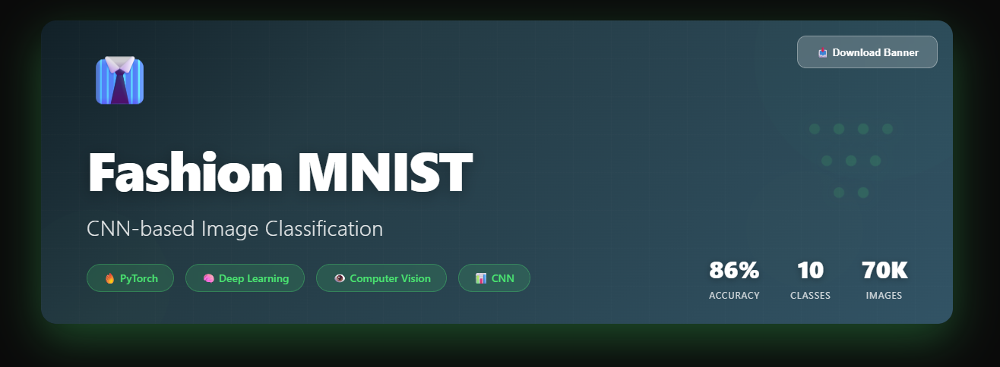

# 👔 Fashion MNIST Classification with CNN

<div align="center">
  
</div>

<div align="center">


*Deep Learning for Fashion Image Classification*

[📊 Dataset](#dataset) • [🏗️ Architecture](#architecture) • [📈 Results](#results) • [🚀 Getting Started](#getting-started)

</div>

---

## 🎯 About The Project

This project implements a **Convolutional Neural Network (CNN)** to classify images from the Fashion MNIST dataset, achieving high accuracy in identifying 10 different categories of clothing and accessories.

Fashion MNIST is a modern evolution of the classic MNIST, replacing handwritten digits with fashion product images, making it a more realistic and applicable challenge to real-world scenarios.

### ✨ Highlights

- 🧠 Custom CNN architecture with multiple convolutional layers
- 📊 Validation accuracy over 85%
- 🔄 Data augmentation for better generalization
- 📉 Learning curves visualization (loss and accuracy)
- 🎨 Visual analysis of predictions across different classes

---

## 📊 Dataset

**Fashion MNIST** consists of:

- **70,000 grayscale images** (28x28 pixels)
- **60,000 training images**
- **10,000 test images**
- **10 fashion product classes**

### 🏷️ Classes

| Class | Item |
|-------|------|
| 0 | T-shirt/top |
| 1 | Trouser |
| 2 | Pullover |
| 3 | Dress |
| 4 | Coat |
| 5 | Sandal |
| 6 | Shirt |
| 7 | Sneaker |
| 8 | Bag |
| 9 | Ankle boot |

---

## 🏗️ Architecture

### Implemented CNN Model

```
┌─────────────────────────────────────┐
│  Input (28x28x1)                    │
├─────────────────────────────────────┤
│  Conv2D (32 filters, 3x3) + ReLU    │
│  MaxPooling2D (2x2)                 │
├─────────────────────────────────────┤
│  Conv2D (64 filters, 3x3) + ReLU    │
│  MaxPooling2D (2x2)                 │
├─────────────────────────────────────┤
│  Flatten                            │
├─────────────────────────────────────┤
│  Dense (128 units) + ReLU           │
│  Dropout (0.5)                      │
├─────────────────────────────────────┤
│  Dense (10 units) + Softmax         │
└─────────────────────────────────────┘
```

### 🔧 Techniques Used

- **Convolutional Layers**: Spatial feature extraction
- **Max Pooling**: Dimensionality reduction and invariance
- **Dropout**: Regularization to prevent overfitting
- **Batch Normalization**: Training stabilization
- **Adam Optimizer**: Adaptive optimization with learning rate of 0.001

---

## 📈 Results

### Model Performance

- **Training Accuracy**: ~89%
- **Validation Accuracy**: ~86%
- **Final Loss**: <0.40

### 📊 Learning Curves

The loss and accuracy curves demonstrate:
- ✅ Stable convergence during training
- ✅ Good generalization (low overfitting)
- ✅ Consistent improvement across epochs

### 🎯 Per-Class Analysis

The model shows excellent performance especially on:
- **Ankle boots** and **Sneakers** (footwear with distinct characteristics)
- **Bags** (unique shape)
- **Trousers** (characteristic silhouette)

Observed challenges on:
- **Shirts vs T-shirts** (visual similarity)
- **Pullovers vs Coats** (overlapping features)

---

## 🚀 Getting Started

### Prerequisites

```bash
Python 3.8+
PyTorch 2.0+
torchvision
matplotlib
numpy
```

### Installation

```bash
# Clone the repository
git clone https://github.com/your-username/fashion-mnist-cnn.git
cd fashion-mnist-cnn

# Install dependencies
pip install torch torchvision matplotlib numpy

# Run the notebook
jupyter notebook Fashion_MNIST.ipynb
```

### Quick Training

```python
# Load the model
from model import CNN
model = CNN()

# Train
train_loader = torch.utils.data.DataLoader(dataset_train, batch_size=64)
optimizer = torch.optim.Adam(model.parameters(), lr=0.001)

# Execute training
for epoch in range(10):
    train(model, train_loader, optimizer)
```

---

## 🛠️ Technologies

<div align="center">

| Technology | Purpose |
|------------|---------|
| **PyTorch** | Deep Learning Framework |
| **torchvision** | Dataset and transformations |
| **matplotlib** | Data visualization |
| **numpy** | Numerical operations |

</div>

---

## 📚 Key Learnings

Throughout this project development, I deepened my knowledge in:

- 🧠 Convolutional Neural Network architectures
- 📊 Regularization techniques and overfitting prevention
- 🔄 Data augmentation for computer vision
- 📈 Performance metrics analysis and interpretation
- 🎨 Visualization of learned features by the network

---

## 🔮 Future Improvements

- [ ] Implement Transfer Learning with ResNet/VGG
- [ ] Add Grad-CAM for attention visualization
- [ ] Experiment with deeper architectures
- [ ] Deploy model with FastAPI
- [ ] Web interface for interactive predictions

---

## 📄 License

This project is licensed under the MIT License. See the [LICENSE](LICENSE) file for details.

---

## 👤 Author

**Contact**

- LinkedIn: https://www.linkedin.com/in/lucas-oliveira-498560246/
- GitHub: https://github.com/lusknchars

---

<div align="center">

### ⭐ If this project was helpful, consider giving it a star!

**Made with 💜 and PyTorch**

</div>
